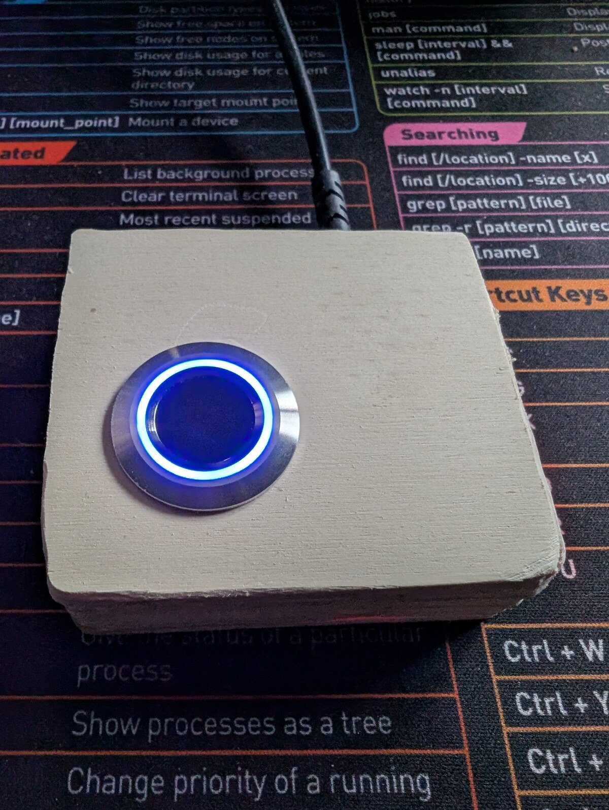

# linux-fingerprint-r503 — fingerprint login for Linux using a Grow R503 + Arduino

A from-parts USB fingerprint reader for Linux desktops. Total parts cost
under $15. Drop-in replacement for upstream `fprintd` — PAM, KDE Settings,
GNOME Settings, `fprintd-verify`, `sudo` with finger, screen-unlock with
finger all work.

**As of `fw=1.0` / `r503d 1.0.0`** the Arduino↔host wire is authenticated:
every command and response carries a SipHash-2-4 MAC keyed to a
TOFU-paired secret in EEPROM. Replay and hot-swap attacks against the USB
serial link are blocked. See [`SPEC.md` §13](SPEC.md) for the full design,
including what the threat model *doesn't* cover.



*wish I had a 3d printer…*

```
   ┌──────────┐   UART    ┌─────────────┐   USB-CDC   ┌──────────────────┐
   │  Grow    │  57600 8N1│  Arduino    │  /dev/r503  │  r503d daemon    │
   │  R503    │◀─────────▶│  (firmware) │◀──────────▶│  net.reactivated │
   │  sensor  │  3.3V TTL │             │  framed,    │  .Fprint on D-Bus│
   └──────────┘           └─────────────┘  MAC'd      └──────────────────┘
                                                              │
                                                              ▼
                                                       PAM, KDE, GNOME,
                                                       fprintd-verify, …
```

## Why

Hardware USB fingerprint readers for Linux are scarce, expensive, and the
ones that exist (Validity, Synaptics, etc.) are reverse-engineered through
unstable libfprint drivers that break with vendor firmware updates. The
Grow R503's protocol is **public**, the Arduino side is your own code,
and the libfprint compatibility layer is just D-Bus.

You also end up with a fingerprint reader you can read the source of, top
to bottom.

## Bill of materials

| Part | Notes | Approx cost |
|------|-------|------|
| Grow R503 capacitive fingerprint sensor | The round one with the RGB ring | ~$10 |
| Arduino Uno R3 / Nano / Mega / any ATmega328 board | Anything that runs SoftwareSerial | $5–$25 |
| 4–6 jumper wires | Dupont / breadboard | trivial |

That's it. **No level shifter, no voltage divider** — see [`SPEC.md` §3.1](SPEC.md)
for why (the R503's RX line is 5V-tolerant in practice; the datasheet lies).

## Wiring

```
R503             Arduino (Uno R3 / Nano / etc.)
----             ------------------------------
Red (VCC)        3V3
White (3.3VT)    3V3                  (touch-IC supply; shares rail with red)
Black (GND)      GND
Yellow (TXD)     D2  ── SoftwareSerial RX
Brown (RXD)      D3  ── SoftwareSerial TX   (direct — no divider!)
Blue (WAKEUP)    D4                          (optional; not used by firmware yet)
```

If your R503 ships with the JST-SH connector, snip a 6-pin JST-SH-to-Dupont
pigtail to break the wires out. Brown is sometimes green depending on the
seller — verify against the wire that goes into the RXD pin of the JST
header, not the colour.

## Build & install

Tested on Fedora 44 KDE; should work on any systemd-based distro with
`fprintd`, `pam_fprintd`, and Rust toolchain.

### 1. Flash the firmware

Open `firmware/r503fp/r503fp.ino` in the Arduino IDE and upload. Or with
`arduino-cli`:

```bash
# Uno R3:
arduino-cli compile --fqbn arduino:avr:uno firmware/r503fp/
arduino-cli upload  --fqbn arduino:avr:uno --port /dev/ttyACM0 firmware/r503fp/

# Nano (modern Optiboot, including most Elegoo / WAVGAT clones):
arduino-cli compile --fqbn arduino:avr:nano:cpu=atmega328 firmware/r503fp/
arduino-cli upload  --fqbn arduino:avr:nano:cpu=atmega328 --port /dev/ttyUSB0 firmware/r503fp/

# Nano with legacy 57600-baud bootloader (older clones):
#   replace `cpu=atmega328` with `cpu=atmega328old`
```

The firmware uses `Adafruit_Fingerprint`. The IDE will offer to install it
on first compile.

If `arduino-cli upload` fails with `not in sync: resp=0x7e`, your bootloader
is the other variant — swap `atmega328` ↔ `atmega328old` and retry. Both
work; the difference is just bootloader baud rate.

### 2. Build the daemon

Requires Rust 1.95+.

```bash
cd pcside/daemon
cargo build --release
```

### 3. Install

```bash
sudo bash pcside/daemon/dist/install.sh
```

That script:

- installs `target/release/r503d` to `/usr/local/bin/r503d`
- creates `/var/lib/r503d/` (mode 0700 root:root) for the key, state, and
  user-slot registry
- writes the udev rule that exposes the Arduino as `/dev/r503`
- installs the systemd unit (`/etc/systemd/system/r503d.service`)
- overrides the D-Bus autolaunch entry for `net.reactivated.Fprint`
- installs the polkit action
  (`/usr/share/polkit-1/actions/net.reactivated.fprint.device.r503d.policy`)
  used by the caller-identity gate
- installs the restrictive system bus policy
  (`/etc/dbus-1/system.d/net.reactivated.Fprint.conf`) — only `root` and
  `wheel` members can talk to the daemon; everyone else hits
  `AccessDenied` at the broker, before the daemon sees the call
- stops and masks upstream `fprintd.service`
- starts `r503d.service`

It's idempotent — re-run it after every `cargo build --release` to
redeploy the new binary.

### 4. Pair the Nano with the daemon

A freshly-flashed Nano is unpaired — the daemon would talk to it but the
firmware would reject every framed command. One-time pairing:

```bash
sudo systemctl stop r503d
sudo mkdir -p /etc/r503d
sudo touch /etc/r503d/allow-pair          # opt-in (see SPEC §13.5)
sudo r503d --pair                          # generates a random 128-bit key,
                                           # writes to /var/lib/r503d/key
sudo systemctl start r503d
```

The opt-in file (`/etc/r503d/allow-pair`) exists to defeat an attacker
racing to your desk with their own Nano — pairing without root is
impossible. `r503d --pair` deletes the marker **before** sending the
key to the Nano: if the host crashes between Nano-side commit and
host-side persistence, the gate is already closed, so the next pair
attempt requires admin to `touch` the marker again. A pre-send bail
(no marker, or "already paired") leaves the marker intact for retry.

Check the pairing state anytime:

```bash
sudo r503d --status
# port:             /dev/r503
# firmware:         fw=1.0 fmt=2
# firmware paired:  true
# firmware counter: 42
# host key.tpm:     (absent)
# host key:         /var/lib/r503d/key
# host key.bak:     /var/lib/r503d/key.bak
# tpm device:       /dev/tpmrm0
# allow-pair:       (absent)
```

### 4b. Optional: seal the host key to the TPM (SPEC §13.12)

On a host with a TPM2 (most Linux desktops + laptops shipped in the last
~8 years), you can replace the plaintext `/var/lib/r503d/key` file with a
TPM-sealed blob bound to **PCR7** (Secure Boot policy). Offline-disk
attackers (`dd` of an unmounted partition, SSD swap into a hostile host)
get ciphertext only.

```bash
sudo systemctl stop r503d
sudo r503d --unpair                        # if previously paired without --seal-tpm
sudo touch /etc/r503d/allow-pair
sudo r503d --pair --seal-tpm               # seals new key to current PCR7
sudo systemctl start r503d
```

`--seal-tpm` writes `/var/lib/r503d/key.tpm` (mode 0600) and removes the
plaintext `key` / `key.bak` files. The daemon at boot tries to unseal;
if PCR7 has changed since pairing (Secure Boot policy edit, MOK enroll,
disk moved to a different machine) the unseal returns `TPM_RC_POLICY_FAIL`
and the daemon refuses to start with a clear journal message. Recovery
is `sudo bash dist/reseal-tpm.sh` (see [Recovery section](#recovery-pcr7-changed-need-to-reseal) below).

Kernel updates, initrd updates, `fwupd` UEFI firmware updates, and grub2
updates do **not** change PCR7 and do not require a reseal.

### 5. Enroll & verify

```bash
# Enroll a finger (use KDE Settings → Users → Fingerprint Auth for a GUI):
fprintd-enroll mat

# Verify:
fprintd-verify mat

# sudo with finger:
sudo whoami
```

Both KDE Settings (Plasma 6) and GNOME Control Center's user-account
fingerprint dialogs drive `r503d` exactly as they drive upstream `fprintd`.

### Re-pair / key rotation

If you want a fresh key (key compromised, planned hardware swap, paranoia):

```bash
sudo systemctl stop r503d
sudo r503d --unpair                        # framed; wipes Nano EEPROM + host key
sudo touch /etc/r503d/allow-pair
sudo r503d --pair                          # fresh random key
sudo systemctl start r503d
```

### Recovery: PCR7 changed, need to reseal

If you used `--pair --seal-tpm` and later changed something that PCR7
measures (Secure Boot turned off/on, new MOK enrolled, disk moved to
another box), the daemon will refuse to start with a journal message
about `TPM_RC_POLICY_FAIL`. Recovery is one command:

```bash
sudo bash pcside/daemon/dist/reseal-tpm.sh
```

The script stops `r503d`, reflashes `firmware/r503fp_wipe/` to wipe the
Nano EEPROM, reflashes the main firmware, creates `/etc/r503d/allow-pair`,
runs `r503d --reseal-tpm` to generate a fresh key sealed to the *current*
PCR7, and starts the daemon back up. Wall-clock: ~90 seconds. Enrolled
fingers are preserved — templates live on the R503 sensor's flash, not
the Nano.

The script needs `arduino-cli` available. If it's installed in your
user's `$HOME/.local/bin` it's auto-detected via `$SUDO_USER`; otherwise
set `ARDUINO_CLI=/full/path/to/arduino-cli` before running.

### Recovery: lost the host key entirely

The authenticated `--unpair` needs the key to authorize. If
`/var/lib/r503d/key` AND `/var/lib/r503d/key.bak` are both gone (disk
crash, accidental rm, etc.), you need the **reflash-to-wipe** escape
hatch:

```bash
sudo systemctl stop r503d
arduino-cli upload --fqbn arduino:avr:nano:cpu=atmega328 --port /dev/r503 firmware/r503fp_wipe/
# Wait ~1s for the wipe to complete (LED starts blinking — that's the wipe sketch).
arduino-cli upload --fqbn arduino:avr:nano:cpu=atmega328 --port /dev/r503 firmware/r503fp/
sudo touch /etc/r503d/allow-pair
sudo r503d --pair
sudo systemctl start r503d
```

This isn't a backdoor an attacker can use: re-pairing requires root on
the host (the opt-in file and the `--pair` CLI both need root), so a
reflashed Nano can't be brought into trust without you already being
root.

### Uninstall

```bash
sudo bash pcside/daemon/dist/uninstall.sh
```

Reverts everything, unmasks `fprintd`, leaves `/var/lib/r503d/` (key,
state, users) in place in case you want to reinstall later. Delete that
directory manually if you want a true clean slate.

## How it works

The Arduino runs a small ASCII-protocol firmware (`firmware/r503fp/`)
that talks the R503's native R30x ("Sync Word") binary protocol on its
UART side and exchanges line-oriented text commands with the host over
USB-CDC: `ping`, `info`, `enroll N`, `verify`, `delete N`, `clear`,
`led off`. Full v1 protocol in [`SPEC.md` §5](SPEC.md).

Since `fw=1.0` (Milestone E of the v2 authenticated-channel work), every
command and response is wrapped in a `C <counter> <body> M <mac>` /
`R <counter> <seq> <body> M <mac>` frame, MAC'd with SipHash-2-4 over a
TOFU-paired 128-bit key. The Nano keeps a wear-leveled monotonic counter
in EEPROM; the daemon keeps a matching counter in `/var/lib/r503d/state.json`.
Replay attempts (firmware-side `incoming <= last_seen`) get rejected as
`ERR replay`; tampered frames get `ERR mac_invalid`. Full spec, threat
model, and known limitations in [`SPEC.md` §13](SPEC.md).

The Rust daemon (`r503d`) speaks D-Bus on `net.reactivated.Fprint` — bit-for-bit
the same interface upstream `fprintd` exposes — so every `fprintd` client
works unmodified. A JSON sidecar at `/var/lib/r503d/users.json` maps
(user, finger) to slot indices in the R503's internal flash.

Layout:

```
firmware/r503fp/             Arduino firmware (v2 framed ASCII protocol)
firmware/r503fp_wipe/        Emergency one-shot EEPROM wipe (lost-key recovery)
firmware/*                   Diagnostic / development sketches (ping, loopback, ...)
pcside/daemon/               Rust daemon (the fprintd replacement)
pcside/daemon/src/{crypto,framing,keystore,state,pairing}.rs
                             v2 wire protocol implementation
pcside/daemon/src/auth.rs    caller-identity gating for D-Bus methods
pcside/daemon/dist/          udev rule, systemd unit, polkit + bus policy,
                             install scripts
docs/                        Decision logs + troubleshooting
SPEC.md                      Full architecture + protocol spec (§13 = v2 auth)
```

## Security model — quick summary

This is a hobby project. The wire-level authentication is designed against
a specific threat — **"evil maid with five minutes and a spare Nano"** —
not against nation-states or hardware attackers with labs.

**Defended:**
- Hot-swap of the Nano with a hostile unit (no key → all frames fail MAC).
- Local process injecting fake match responses on `/dev/r503` (same).
- Replay of recorded `OK match=...` frames in a future session.
- Bit-flip tampering of any frame field (constant-time MAC compare).
- Cross-user fingerprint plant / wipe / enumeration by a local non-root
  user (e.g. `mallory` calling `Claim "root"` then enrolling her own
  finger) — caller identity is checked on every `username`-taking D-Bus
  method, and the system bus policy denies non-`wheel` callers at the
  broker layer.

**Not defended:**
- Host root compromise (key is in `/var/lib/r503d/key`, `0600 root:root`,
  or `/var/lib/r503d/key.tpm` if you opted in to TPM sealing). TPM
  sealing does close *offline*-disk attacks (stolen laptop, SSD swap)
  — see [SPEC §13.12](SPEC.md).
- Physical attack on the Nano (EEPROM readback ~30 sec with ISP; chip decap; etc.).
- Firmware-reflash attack (the Arduino bootloader has no signing — but
  re-pairing requires root on the host, so a reflashed Nano can't be
  brought into trust without host compromise anyway).
- R503-side compromise (R30x protocol has no auth at all; out of our scope).
- **No formal cryptographic review.** The primitives are standard, the
  constructions are conventional, the implementations are short and
  cross-verified against published vectors — but no professional has
  audited the design. PRs welcome.

Full threat model with rationale: [`SPEC.md` §13.1](SPEC.md).

## Limitations

- **Multi-user works, but only for `wheel` members.** Caller identity is
  checked on every D-Bus method that takes a `username` (`Claim`,
  `EnrollStart`, `VerifyStart`, `ListEnrolledFingers`,
  `DeleteEnrolledFingers`); self-requests and `uid 0` (PAM) succeed
  silently, cross-user from a non-root caller is denied with
  `net.reactivated.Fprint.Error.PermissionDenied`. The system bus policy
  further restricts which accounts can even start a conversation: only
  `root` and `wheel` members reach the daemon, everyone else gets
  `org.freedesktop.DBus.Error.AccessDenied` at the broker layer.
  Need cross-user enroll? Become root: `sudo fprintd-enroll target-user`.
  Need to loosen the cross-user gate for a kiosk / multi-user lab? Drop
  a JS rule into `/etc/polkit-1/rules.d/` targeting
  [`net.reactivated.fprint.device.setusername`](https://gitlab.freedesktop.org/libfprint/fprintd/-/blob/master/src/net.reactivated.fprint.device.policy.in)
  — the action name mirrors upstream fprintd verbatim.
- **One reader.** The daemon exposes a single Device object on D-Bus.
  Multi-reader setups need an extension to the Manager.
- **No `PropertiesChanged` emit** for the `finger-present` / `finger-needed`
  hint properties. Every common fprintd client (PAM, KDE Settings, GNOME)
  drives off `EnrollStatus` / `VerifyStatus` signals (which are emitted),
  not those polled hints — but a strict client that does
  `Get + PropertiesChanged` will see stale values.
- **Single Nano = single point of failure.** If the Nano dies, fingerprint
  login is gone until you reflash a spare and re-pair. Keep a password
  auth method enabled as backup.
- **No `r503d --resync` yet.** If `state.json` is lost while the firmware
  still has a high `last_seen`, the daemon will hit `ERR replay` on first
  send and need a manual reflash-to-wipe + re-pair. See [`SPEC.md` §13.11](SPEC.md).

## Troubleshooting

```bash
# Daemon logs:
sudo journalctl -u r503d.service -f

# Confirm the sensor enumerates correctly:
ls -l /dev/r503
busctl --system call net.reactivated.Fprint /net/reactivated/Fprint/Device/0 \
    net.reactivated.Fprint.Device ListEnrolledFingers s ""

# Confirm fprintd is masked and r503d owns the bus name:
systemctl is-enabled fprintd  # should print "masked"
busctl --system list | grep -i fprint
```

If the daemon won't start or the sensor never responds, the most common
fix is the wiring — see [`SPEC.md` §3](SPEC.md), particularly the
**"no voltage divider"** note in §3.1. There's a more detailed runbook
in [`docs/TROUBLESHOOTING.md`](docs/TROUBLESHOOTING.md).

## License

MIT — see [LICENSE](LICENSE).

## Credits

- [Adafruit_Fingerprint](https://github.com/adafruit/Adafruit-Fingerprint-Sensor-Library)
  — Arduino-side R30x protocol implementation.
- [zbus](https://github.com/dbus2/zbus),
  [serialport-rs](https://github.com/serialport/serialport-rs),
  [tokio](https://tokio.rs/) — the Rust D-Bus / serial / async stack.
- The `fprintd` project — for designing a clean D-Bus interface that
  this daemon could implement against without ever reading
  `libfprint`'s source.
